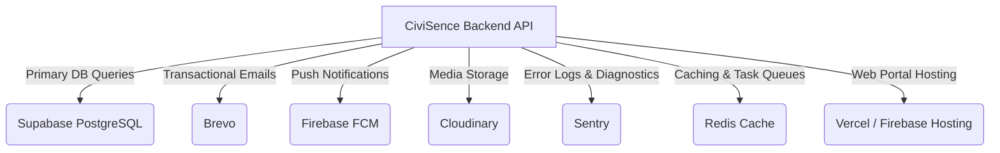

# CiviSence Privacy Policy

**Version:** 0.0.0.1  
**Effective Date:** July 8, 2026  
**Last Updated:** July 8, 2026  

---

## 1. Introduction

### 1.1 Who We Are
Welcome to CiviSence. This Privacy Policy governs the processing of personal data by **CiviSence** (referred to as "we," "us," or "our"), the operator of the CiviSence civic issues reporting, demand-aggregation, and community voting system. We are committed to protecting the privacy, confidentiality, and security of all personal data we collect from our users.

### 1.2 What CiviSence Is
CiviSence is a digital platform designed for organizations—including universities, colleges, schools, local municipalities, neighborhood associations, and private companies—to report, catalog, track, vote on, and resolve civic and infrastructure issues. CiviSence operates as a hybrid software-as-a-service (SaaS) and community demand-aggregation tool. Users within registered Organizations can submit issues (such as maintenance failures, broken equipment, or safety concerns), participate in public or anonymous polls, upvote existing complaints to highlight collective demand, and engage in peer-to-peer direct communications. Administrative team members use our suite of official tools to audit reports, assign tasks to maintenance or operational workers, and manage community feedback.

### 1.3 Acceptance of this Policy
By registering an Account, logging into our website or mobile applications, submitting issue reports, voting, or using any services provided under the CiviSence brand, you explicitly consent to the collection, storage, use, and disclosure of your personal information as described in this Privacy Policy. If you do not agree with the terms of this Privacy Policy, you must not access or use the Services, and you may request the deletion of your account at any time.

---

## 2. Definitions

To ensure transparency, the following terms are defined in alignment with the technical architecture of our system:
* **Account:** The secure credential set, profile, and authorization token mapping that allows a User to access and use the CiviSence platform.
* **Device:** Any hardware capable of accessing our services, including desktop web browsers, iOS mobile devices, and Android mobile devices, which registers with our notification endpoints.
* **Direct Messages:** Private, peer-to-peer text communications transmitted and stored between two distinct Users on the CiviSence platform.
* **Issue:** A user-generated civic report detailing an infrastructure, electrical, plumbing, safety, or administrative concern, including its categories, descriptions, addresses, buildings, and associated media uploads.
* **Organization:** A bounded entity (such as a specific college, university campus, municipality ward, or corporate office) that holds its own user directory, configuration settings, issues feed, and dashboard.
* **Personal Data:** Any information relating to an identified or identifiable natural person, specifically including credentials, academic registry parameters, contact details, and technical identifiers.
* **Platform Audit Log:** An immutable, non-deletable log entry recorded for security auditing purposes capturing actions taken by Platform Executives or Developers.
* **Services:** The CiviSence backend API, the frontend web application, and the companion mobile applications.
* **User:** Any registered individual who accesses the services, classified as a Citizen/Student, Official/Staff, Administrator, or Platform Executive.

---

## 3. Information We Collect

We collect several categories of information to verify identities, run our demand-aggregation engine, and protect the security of our platform. This collection occurs both through direct user input and automated system processes.

### 3.1 Information You Provide

#### A. Account Registration and Authentication Data
When you register for CiviSence, we collect:
* **Email Address:** Used as your unique login identifier, for transactional communications, and for peer-verification matches.
* **Password:** We collect your password during registration. Passwords are never stored in plain text; they are immediately hashed using bcrypt prior to database storage.
* **Verification OTP:** Temporary, time-expiring One-Time Passwords (OTPs) sent to your registered email address to verify your account or authorize password resets.

#### B. Profile and Identity Information
To verify your eligibility within a specific Organization (e.g., confirming you are a student at a particular university or a resident in a particular ward), we collect:
* **Full Name:** To represent you on issues, comments, and admin rosters.
* **Date of Birth:** To verify age eligibility and comply with minor-protection regulations.
* **Gender:** Collected voluntarily for demographic aggregation and user profiling.
* **Phone Number:** Collected for two-way notifications, profile validation, and account recovery.
* **Pincode / Address:** Used to place you in the correct geographic municipal ward or region.
* **Academic/Professional Metadata:** For institutional organizations, we collect registration numbers, employee IDs, department names, course names, study years, semesters, and professional designations.
* **Hostel/Housing Details:** For residential campuses, we collect hostel building names and room numbers to pin issue reports to exact physical locations.
* **Verification Proof:** Files or documents (such as photos of student IDs, utility bills, or official letters) uploaded by the user to request identity verification under peer or manual review.

#### C. Issue Reports and Demand Data
When you participate in the civic feedback loop, we collect:
* **Issue Metadata:** Title, description, primary category (e.g., Electrical, Plumbing, Maintenance), subcategory, location address, target building name, and ward names.
* **Votes:** Record of upvotes and downvotes placed on issues to compute community demand priority.
* **Poll Responses:** Votes cast on anonymous or public polls associated with issues or organizations.
* **Comments:** Text commentary, questions, and replies posted under public issue records.
* **Media Uploads:** Images or videos documenting the reported issue (or documenting its resolution).

#### D. Private Communications
* **Direct Messages:** The text content, timestamps, and read-receipt status of private messages exchanged between users.

---

### 3.2 Technical Information We Collect Automatically

#### A. Session and Connectivity Data
Every time you interact with our API, we collect:
* **IP Address:** Captured in our session database to detect anomalous logins, geo-authenticate requests, and maintain audit trails.
* **User Agent Header:** Captures web browser names, browser versions, operating systems, and device system profiles to format payloads correctly and detect security threats.
* **Session Lifecycles:** Tracked in the database (`user_sessions`), capturing the token identifier, device type, last activity timestamp, creation time, expiration time, and revocation status.

#### B. Device Tokens
* **Firebase Cloud Messaging (FCM) Tokens:** Unique device identifiers generated by Google Firebase to route push notifications to your specific Android, iOS, or web browser installation. We store the token, device type (`android`, `ios`, or `web`), device model name, and its active state.

#### C. Behavioral Analytics
* **User Event Logs:** High-volume user activities tracked under the `user_events` table, registering specific occurrences such as issue views, search queries, filter actions, advertisement impressions, and ad clicks, alongside device and page-context metadata.

#### D. Crash Diagnostics
* **System Log Diagnostics:** Stack traces, error events, transaction metrics, and performance bottlenecks captured and sent automatically to our error-logging pipeline (Sentry) during application errors.

---

## 4. How We Use Your Information

We process your Personal Data strictly to provide a secure, functional, and responsive civic reporting application. Our processing includes the following core operational objectives:

### 4.1 Authentication and Account Management
We use your email, hashed password, and OTPs to verify your identity, authorize access to organization workspaces, maintain active login sessions across multiple devices, and facilitate password recovery requests.

### 4.2 Core Service Delivery (Demand Aggregation)
We process issue text, categories, locations, comments, votes, and poll selections to compile public community feeds. This data is fed into mathematical models that aggregate community interest, calculate trending request scores, and sort complaints by priority to ensure officials address high-demand infrastructure failures first.

### 4.3 Notification Delivery Channels
We process your contact details and FCM tokens to deliver notifications via:
* **In-App Alerts:** Live alerts visible in the dashboard feed.
* **Push Notifications:** Instant alerts sent directly to your mobile device or desktop browser regarding issue status changes, comments, or direct messages.
* **Emails:** Transactional system updates (e.g., account activation, verification approval, or official messages from administrators) sent via Brevo.

### 4.4 Moderation, Safety, and Spam Protection
We use automatically collected metadata, user report flags, and administrative controls to screen, moderate, and filter user uploads. We enforce anti-spam cooldown rules (such as a maximum of 3 issue reports per user per 24 hours) and run normalization routines to prevent the creation of duplicate civic demands. We process account statuses to ban or suspend users who violate community terms.

### 4.5 Pre-aggregated Performance Analytics
We aggregate user events (such as views, active user counts, and issue status transitions) into daily performance snapshots (`activity_snapshots`). These pre-aggregated metrics are used to render dashboard visualizations showing Daily Active Users (DAU), Monthly Active Users (MAU), average issue resolution times, and community sentiment metrics, while keeping database query overhead minimal.

### 4.6 Audit Logs and Security Enforcement
For security and compliance verification, actions performed by administrative accounts, officials, and platform executives (such as user bans, organization suspensions, or role promotions) are permanently recorded in the `platform_audit_logs` table. These records include the administrative ID, action type, target ID, metadata payload, and IP address.

### 4.7 Technical Troubleshooting and Logging
We process diagnostics and error traces via Sentry to resolve software bugs, investigate database connection timeouts, monitor query performance, and ensure high system uptime.

---

## 5. Legal Basis for Processing

If you access our Services from regions requiring a defined legal basis for processing personal data (such as India under the Digital Personal Data Protection Act, 2023, or the European Economic Area under the General Data Protection Regulation - GDPR), we process your data under the following legal frameworks:

* **Consent:** We process your personal profile data, verification documents, and contact details based on the explicit consent you provide during registration, onboarding, and manual verification requests. You have the right to withdraw this consent at any time.
* **Performance of a Contract:** The processing of your account credentials, session states, issue uploads, comments, votes, and direct messages is necessary to deliver the features and services requested by you, as governed by our Terms of Service.
* **Legitimate Interests:** We process diagnostic logs, session history, IP addresses, and event statistics to maintain platform security, prevent spam/bot farms, optimize performance, evaluate community engagement, and defend against fraudulent activities.
* **Compliance with Legal Obligations:** We retain transaction parameters, financial statements (if any), platform executive audit trails, and security records to comply with statutory data retention or reporting mandates.

---

## 6. How We Share Information

We do not sell, rent, or trade your Personal Data to third-party data brokers or marketing agencies. Your information is shared only under the following limited circumstances:

### 6.1 With Registered Organizations
CiviSence is an organization-centric platform. If you join a workspace (e.g., a specific college campus or a municipal ward), your name, profile photo, department, issue reports, comments, public poll votes, and civic upvotes will be visible to other verified members, officials, and administrators belonging to that same Organization.

### 6.2 With Trusted Service Providers
We share necessary personal and technical data with third-party service providers who perform critical infrastructure operations on our behalf:
* **Supabase / PostgreSQL:** Hosts our primary relational database, storing all profile, issue, session, and configuration tables securely.
* **Cloudinary:** Hosts and processes user-uploaded media (profile avatars, issue photos, verification proofs, and resolution images/videos).
* **Brevo:** Dispatches transactional registration emails, password reset links, and system notifications.
* **Google Firebase Cloud Messaging (FCM):** Delivers push notification packets to registered mobile and web devices.
* **Sentry:** Collects and analyzes real-time application crash diagnostics and stack traces.
* **Redis:** Caches active session tokens, coordinates celery background task workers, enforces API rate limiting, and supports cached operations.
* **Vercel and Firebase:** Host and serve the frontend website and user portal assets.

### 6.3 For Law Enforcement and Legal Compliance
We may disclose your Personal Data if required to do so by applicable law, regulation, or legal subpoena. This includes sharing details with police forces, cyber-crime units, national data protection authorities, or court officers to:
* Comply with statutory data retention or reporting mandates.
* Protect the physical safety or property of our users, staff, or the public.
* Investigate, prevent, or prosecute cyber-attacks, database breaches, identity theft, or platform fraud.

### 6.4 Business Transfers
In the event of a merger, acquisition, corporate restructuring, asset sale, or bankruptcy, user databases and stored Personal Data may be transferred to the acquiring or successor entity, subject to the protections outlined in this Privacy Policy.

### 6.5 Public Content
Issues, comments, votes, and public polls are intended to be shared within your Organization. Once you publish an issue or comment, it is visible to other authorized members of your workspace. Administrators and officials may also export issue rosters to local municipal authorities or university administrators to secure repair actions.

---

## 7. Third-Party Service Integrations

CiviSence integrates with several third-party platforms to execute file management, notification, database, and diagnostics routines. Below are the details of these integrations:

### 7.1 Supabase Database (PostgreSQL)
All structured data (including user profiles, encrypted session logs, issue history, comments, and votes) is stored on databases hosted and managed by Supabase. Supabase maintains high security standards, data encryption at rest, and logical tenant isolation.
* **Data Transferred:** All user records, schema rows, and session parameters.
* **Privacy Link:** [Supabase Privacy Policy](https://supabase.com/privacy)

### 7.2 Cloudinary
Users upload binary files (such as JPEG/PNG images, MP4 videos, and PDF proofs) directly through our upload endpoint, which routes them to Cloudinary. Cloudinary processes, resizes, and serves these media assets.
* **Data Transferred:** User avatars, issue photos/videos, resolution media, and verification identity documents.
* **Privacy Link:** [Cloudinary Privacy Policy](https://cloudinary.com/privacy)

### 7.3 Brevo
All transactional emails (such as onboarding codes, password resets, and admin invitations) are dispatched through Brevo's SMTP relays.
* **Data Transferred:** Recipient name, email address, and transactional email template metadata.
* **Privacy Link:** [Brevo Privacy Policy](https://www.brevo.com/legal/privacypolicy/)

### 7.4 Google Firebase (FCM)
FCM handles the queueing and delivery of push notifications to user devices.
* **Data Transferred:** FCM registration tokens, notification titles, alert body snippets, and device type designations.
* **Privacy Link:** [Google Privacy Policy](https://policies.google.com/privacy)

### 7.5 Sentry
When the backend API raises unhandled exceptions, diagnostic traces are forwarded to Sentry.
* **Data Transferred:** Exception logs, stack traces, request parameters (excluding raw passwords), browser configurations, and API endpoint paths.
* **Privacy Link:** [Sentry Privacy Policy](https://sentry.io/privacy/)

### 7.6 Redis Cache
Used for processing celery tasks, managing transactional locks, caching session tokens, and tracking rate limits.
* **Data Transferred:** Session token keys, temporary task descriptors, and IP address rate limit logs.

### 7.7 Vercel and Firebase Hosting
Our frontend web portal is deployed and served to users worldwide via Vercel's edge network and Firebase Hosting services.
* **Data Transferred:** Client-side routing data, technical session parameters, and browser telemetry.
* **Privacy Links:** [Vercel Privacy Policy](https://vercel.com/legal/privacy-policy) & [Firebase Privacy Policy](https://firebase.google.com/support/privacy)

---

## 8. Cookies and Similar Technologies

We use cookies, local storage, and token caches to maintain security and deliver consistent user configurations.

### 8.1 Session Management
We use HTTP-only, secure cookies or local storage elements to hold authorization JWT tokens. These tokens identify your session to the backend API without requiring you to re-enter your password on every request.

### 8.2 Security Tokens
JWTs are configured with cryptographically signed tokens containing a unique token identifier (`token_jti`). This allows the system to verify that the incoming token matches an active session registered in the database, preventing session hijacking.

### 8.3 User Preferences
We store configuration states (such as preferred theme mode, selected organization context, and locale parameters) within your device's local storage or via cookies.

---

## 9. Data Retention and Account Deletion

### 9.1 General Retention Principles
We retain your Personal Data for as long as your Account remains active, or as long as necessary to fulfill the purposes outlined in this policy. If you request the deletion of your account, we trigger a sanitization workflow to balance your right to be forgotten with the integrity of the collective database.

### 9.2 Account Deletion Workflow
When a user requests account deletion, the system executes the following steps:
1. **User Table Update:** The user's active flag (`is_active`) is set to `False`. The personal fields (email, name, phone, address, registration number, date of birth, and gender) are either physically deleted or scrambled with cryptographically random noise.
2. **Hashed Passwords:** The user's hashed password column is deleted or replaced with an unmatchable system-generated string.
3. **Session Revocation:** All active user sessions in the `user_sessions` table and device FCM tokens in the `user_devices` table are permanently deleted.
4. **Issue Reports Retention (Anonymization):** To prevent breaking the historic timeline of reported community problems, issues submitted by the user are **not** deleted. Instead, they are anonymized. The foreign key mapping points to a system "Deactivated User" profile, and any personal markers are stripped from the issue description.
5. **Comments and Votes:** Public comments are kept but marked as authored by an "Anonymous User." Votes are retained to preserve the integrity of historical issue scores and poll results.
6. **Direct Messages:** Private direct messages sent by the deleting user will be marked as deleted for the sender, but may remain visible in the recipient's message inbox for up to 90 days before final deletion, unless both parties delete the conversation.

### 9.3 Immutable Audits
Actions stored in the `platform_audit_logs` table (such as records of an admin banning the user for Terms violations) are kept permanently. These logs are preserved to satisfy security verification requirements and defend against legal claims, but are stripped of direct user associations where possible.

---

## 10. Data Security

We implement rigorous technical and organizational security measures to protect your Personal Data against unauthorized access, alteration, disclosure, or destruction.

### 10.1 Cryptographic Protections
* **Password Hashing:** All user passwords are encrypted using Bcrypt prior to writing to our PostgreSQL database. We never view, transmit, or record plain text passwords.
* **Encryption in Transit:** All connections between client applications, our backend servers, and our database systems are encrypted using HTTPS and SSL/TLS protocols (`sslmode=require`).
* **JWT Signatures:** Authentication tokens are signed using HMAC-SHA256 signatures with a secure, server-side secret key.

### 10.2 Database Protections
* **Connection Fast-Fails:** Database timeouts are set strictly (e.g., 5-second connection limits, 30-second query limits, and 10-second lock limits) to prevent resource exhaustion attacks.
* **SQL Injection Defenses:** All database queries are generated through SQLAlchemy's Object Relational Mapper (ORM), which automatically parameterized user inputs to prevent SQL Injection (SQLi) attacks.
* **Rate Limiting:** IP-based and user-based API rate limiting is enforced via Redis to mitigate brute-force password checks and denial-of-service (DoS) attempts.

### 10.3 Backups and Disaster Recovery
* **Database Backups:** Supabase PostgreSQL databases execute real-time write-ahead logging and database mirroring, enabling automated point-in-time recovery and regular backups to prevent data loss.

---

## 11. Your Legal Rights

Depending on your geographic location, you possess specific statutory rights regarding your Personal Data under frameworks such as the Indian DPDP Act 2023, the European GDPR, or California's CCPA.

* **Right of Access:** You can request a copy of all Personal Data we hold about you, including your profile details, session logs, and posted issues.
* **Right to Correction/Rectification:** You can edit your profile information at any time through your dashboard or request that we update inaccurate credentials.
* **Right to Erasure (Right to be Forgotten):** You can request that we delete or anonymize your Personal Data from our systems using our account deletion workflow.
* **Right to Data Portability:** You have the right to request that we export your data in a structured, commonly used, and machine-readable format.
* **Right to Restriction of Processing:** You can ask us to pause the processing of your Personal Data in certain circumstances, such as when you contest the accuracy of your profile verification details.
* **Right to Withdraw Consent:** Where our processing is based on your consent (such as document-based profile verification or email notifications), you can withdraw your consent at any time, which will halt further processing for those tasks.
* **Right to File Complaints:** You have the right to lodge a complaint with your local data protection authority (such as the Data Protection Board of India or EEA Supervisory Authorities) if you believe our processing violates applicable laws.

---

## 12. Children's Privacy

### 12.1 Minimum Age Requirement
CiviSence is not designed for children under the age of 13. We do not knowingly collect, verify, or maintain Personal Data from individuals under this age limit.

### 12.2 Verification of Minors
If we discover that a user under the age of 13 has registered an account and provided personal profile information without verifiable parental consent, we will terminate the account and delete all associated personal rows immediately. For school-based organizations where students aged 13 to 17 access the platform, profile verification requires document or peer reviews to verify enrollment status, and parent/guardian oversight is recommended.

---

## 13. International Data Transfers

CiviSence is managed and operated globally, with backend infrastructure, storage pools, and server nodes located across multiple international jurisdictions. 
* **Hosting Boundaries:** While the primary user base may reside in India, our database hosting provider (Supabase) and deployment platforms (Vercel, Firebase, Cloudinary) host databases, cache clusters, and file distribution servers in data centers located in the United States, Europe, and Asia.
* **Cross-Border Protections:** When transferring Personal Data outside of your home country, we ensure the recipient service providers adhere to appropriate safeguards, including Standard Contractual Clauses (SCCs), data encryption standards, and local regulatory requirements.

---

## 14. Changes to This Privacy Policy

We may update this Privacy Policy from time to time to reflect database updates, security revisions, or changes in legal frameworks.
* **Policy Versioning:** Every revision will be marked with a new version number (e.g., 1.1.0) and display the current "Last Updated" date.
* **Notification of Material Changes:** If we implement changes that significantly affect your privacy rights or how we process your personal fields, we will notify you by:
  * Sending an email notification via Brevo or our official channels.
  * Posting a prominent notice on our website or mobile application dashboard at least 14 days before the changes take effect.

---

## 15. Contact Us

If you have any questions about this Privacy Policy, wish to exercise your legal rights, or want to submit feedback regarding our data handling practices, please contact us:

* **Support Emails:** 
  * [civisence@gmail.com](mailto:civisence@gmail.com)
  * [civisence@zohomail.in](mailto:civisence@zohomail.in)
* **Web Contact:** Through the official contact form at the landing page of the CiviSence portal (hosted on Vercel & Firebase).
* **Grievance Desk:** For inquiries under India's Digital Personal Data Protection Act (DPDP), 2023, you can email our grievance representatives at [civisence@zohomail.in](mailto:civisence@zohomail.in).
